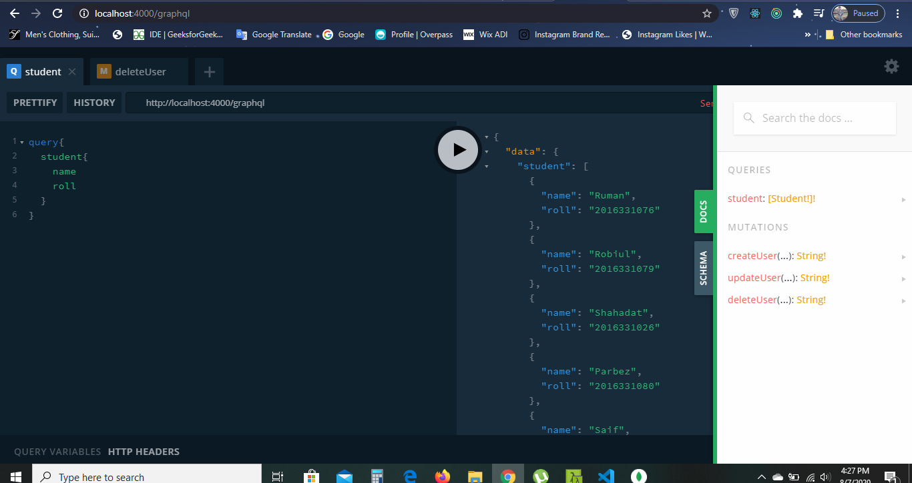

# A Simple GraphQL Server Performing Query(GET) Mutation(PUT,PATCH,UPDATE,DELETE) Operations 😉😐

## GraphQL is a powerful query language which can be used in any kind of front-end and back-end applications to fetch data or updating,deleting data 
## for Creating this GraphQL Server [GraphQL Yoga](https://www.npmjs.com/package/graphql-yoga) & [Apollo Server express](https://www.npmjs.com/package/apollo-server-express) has been used

### How to use it :

####  1 .  After downloading the zip file extract it and open the project in your fabourite code editor like [VS Code](https://code.visualstudio.com/) or [Atom](https://atom.io/)
####  2 .   then open cmd or [Hyper](https://hyper.is/) or [Cmder](https://cmder.net/) terminal inside this project directory and type `npm install` and hit enter.
####  Because of running this command every packages needed for your project which are mentioned in `package.json` file will be installed automatically and a new directory will be created `node_modules` which contains those packages.

####  3 . `mongoose.connect("mongodb://localhost:27017/RESTDB", {useUnifiedTopology: true, useNewUrlParser: true});` Here Instead of using Local mongodb Database you can use
####  mongodb online database like [MLab](https://mlab.com/) or [MongoDB Atlas](https://www.mongodb.com/cloud/atlas) to store your data upto 512 mb for free.So go any of the website
#### and create a new database & add the url of that database inplace of  `mongodb://localhost:27017/RESTDB` 

#### 4. If you wanna use your local mongodb then go to terminal and type `mongod` & hit enter.After that you can make CRUD(Create Read Update Delete) operations on mongodb databases.Otherwise you can't

#### 5. To view your database you need [Robo 3T](https://robomongo.org/) or [MongoDB Compass](https://www.mongodb.com/products/compass) installed your pc

#### 6. In terminal type `npm install -g nodemon` to install [Nodemon](https://www.npmjs.com/package/nodemon) Globally so that in other applications you don't have to install Nodemon again
#### This restarts your server automatically when save changes you dont have to type `node server.js` every time after change.
####   now type `nodemon server.js` this will starts your server & if everything becomes alright you will see the message `Server is listening at localhost:4000/graphql` in console 

#### 7. Now open Google Chrome or your fabourite Browser and type  `http://localhost:4000/graphql` you will see something like  

#### 8.Again If you want to send query,mutation operations over [Postman](https://www.postman.com/).Open Postman and select method type POST and then go to body option and paste your query like
 ####      `query{ `
####            `student{`
####               `name`
####                `roll`
####               `}`
####            `}`
#### then click send button you will get your data back as response in the Postman GUI 

